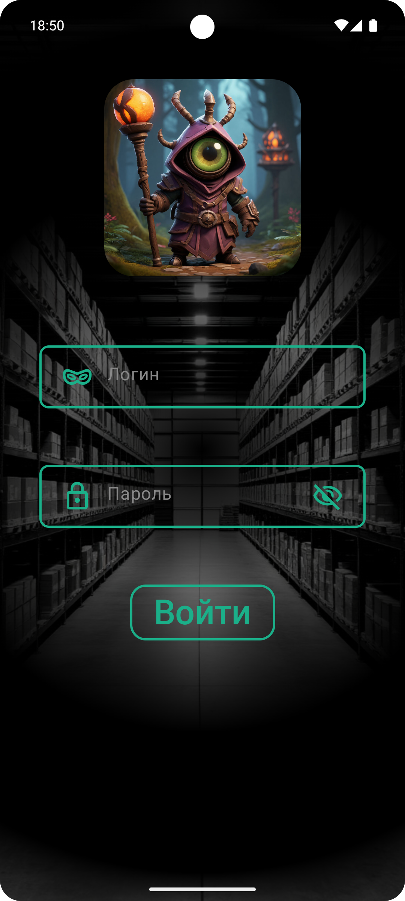
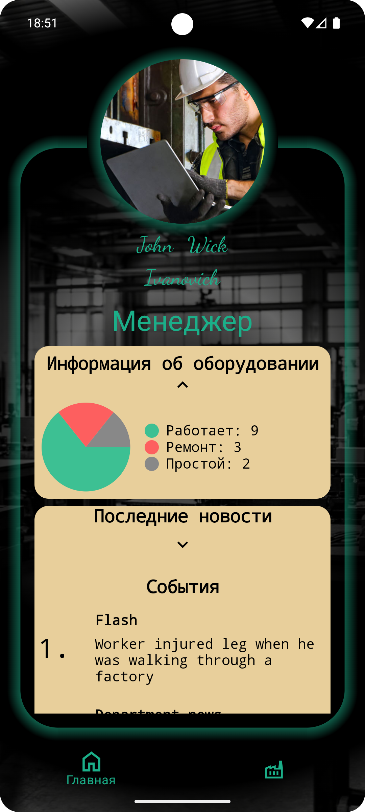
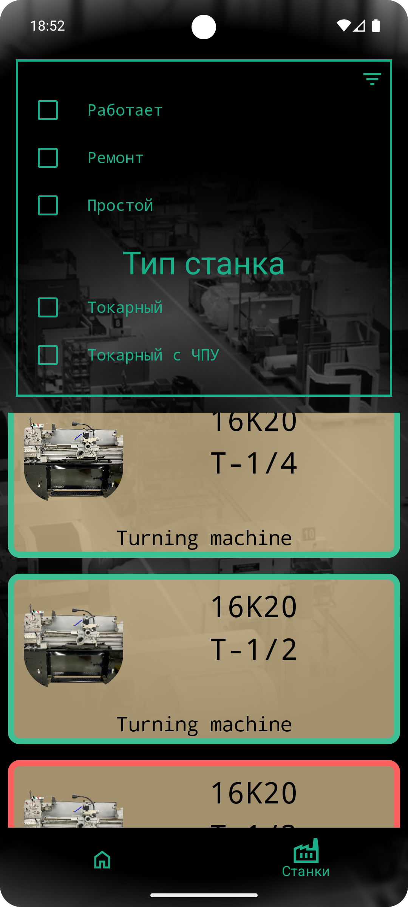
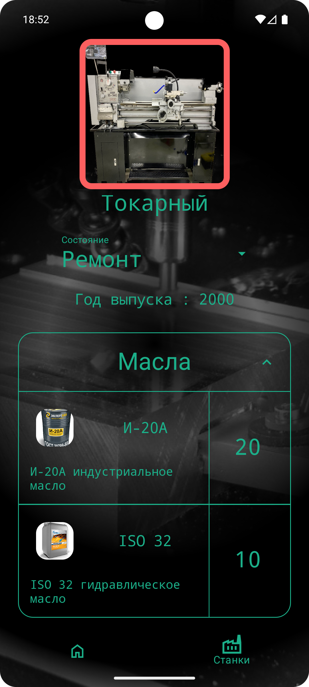
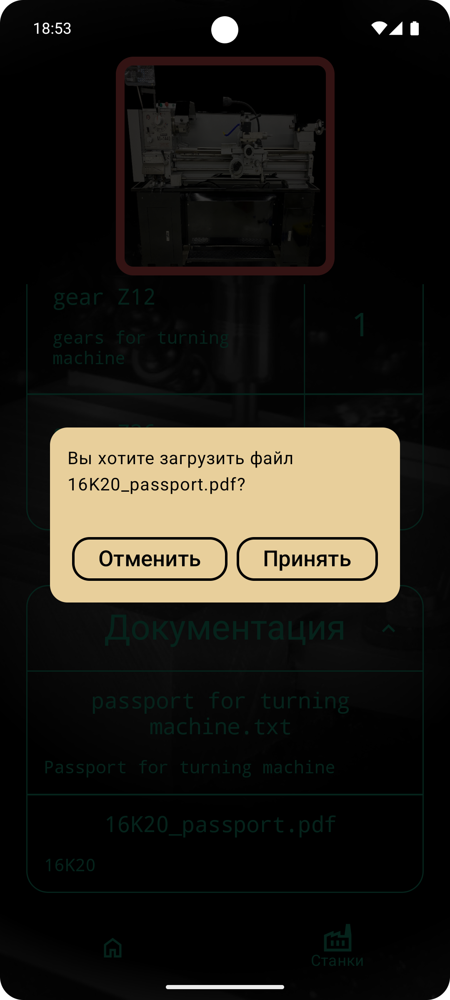
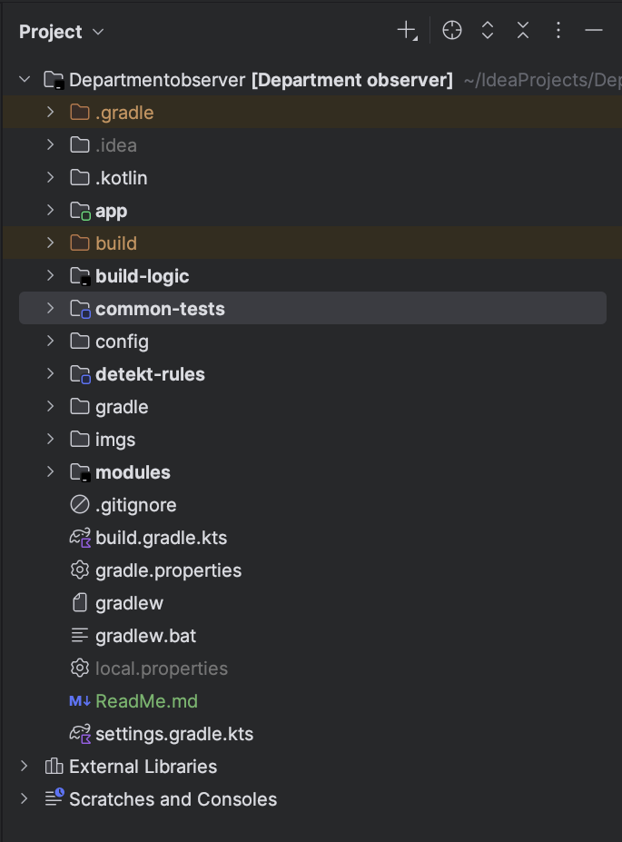
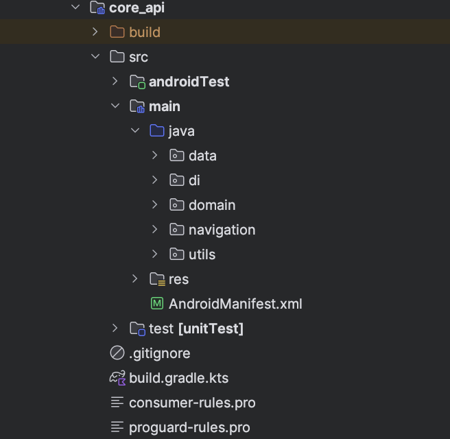
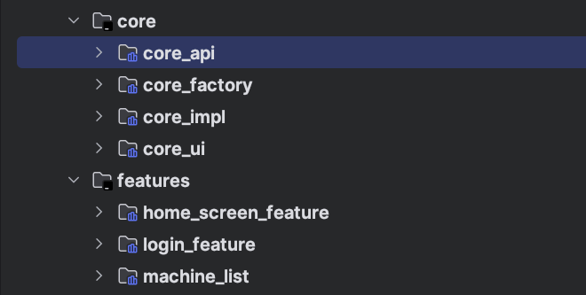

# Department Observer

Приложение служит для **ускорения** и **облегчения** работы подготовки 
производства на машиностроительном производстве. 
В приложении можно найти полезную информацию на оборудование, находящееся в цеху,
такую как:
- Запчасти
- Масла
- Документация

Так же отображается текущее состояние оборудование (ремонт, простой или в работе). Данная информация позволит
оперативно внести корректировки в производственный процесс.

### В приложении вы встретите следующие экраны

#### 1. Экран для в хода в систему
Тут вы вводите свой логин и пароль

#### 2. Домашний Экран

На этом экране отображается основная информация о подразделении

#### 3. Список оборудования

На этом экране выводится все оборудование, имеющееся в подразделении.

#### 4. Экран с информацией о станке

Экран с информацией о станке и возможностью изменить его состояние.(Ремонт, простой и работает)

### Используемый стек:

- Gradle
- Kotlin
- Android SDK
- Ktor client
- Dagger 2
- Jetpack Compose
- Junit 4 and Mockito
- Detekt

#### Описание программной части:
Приложение имеет многомодульную структуру для облегчения добавления нового функционала.

Была выбрана слоистая архитектура.

Для инъекции зависимостей используется Dagger2 с разделением core модулей для ускорения сборки проекта.

Это клиент серверное приложение и для обмена данными используется Ktor client.

Для UI используется Jetpack Compose.
Были созданы нестандартные экраны, для визуальной составляющей.
Использовал Slot API

Для тестирования используется JUnit 4 and Mockito

Тестами покрыт репозиторий и ViewModels (отслеживаем изменения стейта)

Для Ui тестов использовался Kaspresso
Были написаны элементарные сценарии.

Для статического анализа кода к проекту подключен Detekt